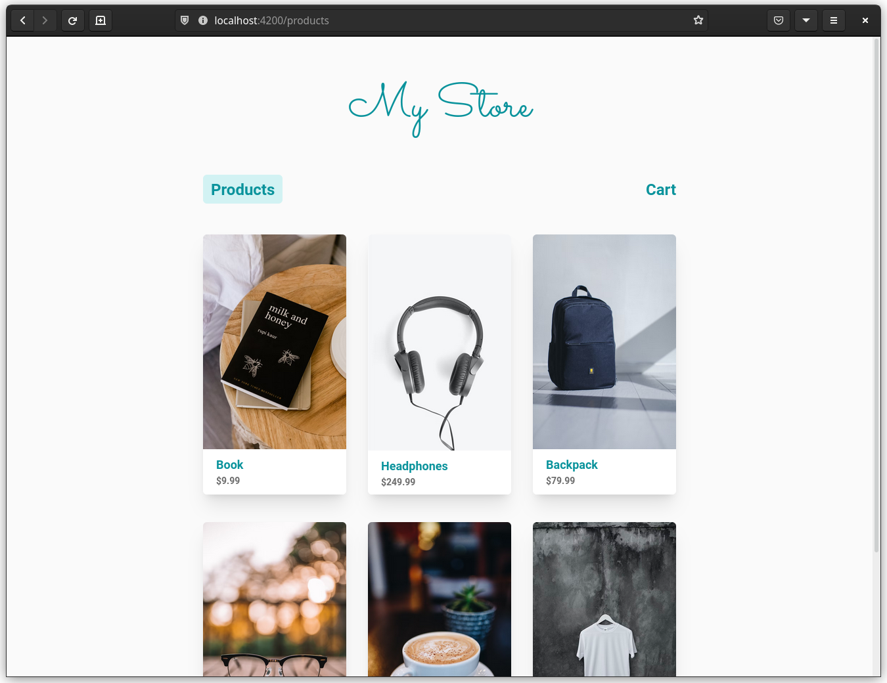
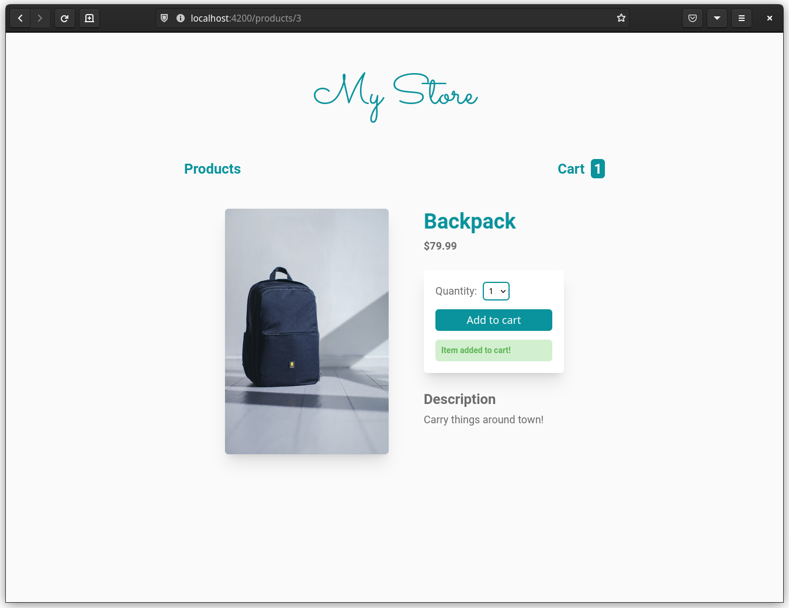
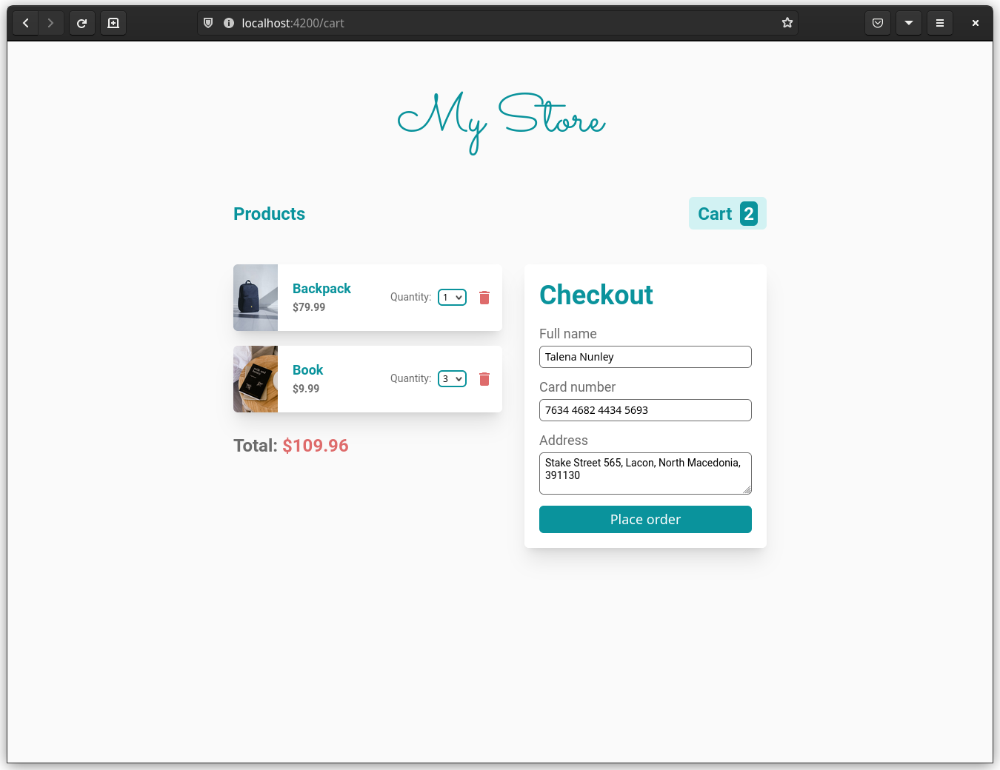
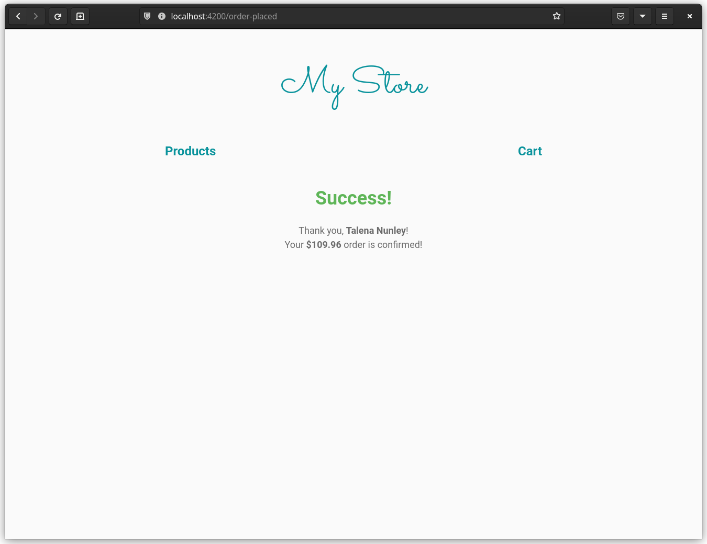

# MyStore

A frontend for a hypothetical store built with Angular.

## Running the project

Run the following commands to clone and run the project

```shell
git clone https://github.com/srijan-nayak/my-store.git
cd my-store

yarn
# or
npm i

yarn start
# or
npm start
```

The app will be visible on [localhost:4200](http://localhost:4200/).

## Features

### Products list page



- See list of available products
- Click on the name of a product to navigate to its details page

### Product details page



- See all the details for a particular product
- Add the product to cart through a template driven form

### Cart page



- Delete or change quantity of items in cart
- Check cart total
- Template driven checkout form with validation

### Order placed confirmation page



- See a confirmation for placing the order after submitting the checkout form
